# Chat App

A modern messaging application built with Flutter and Appwrite that provides a seamless communication experience with a rich feature set.

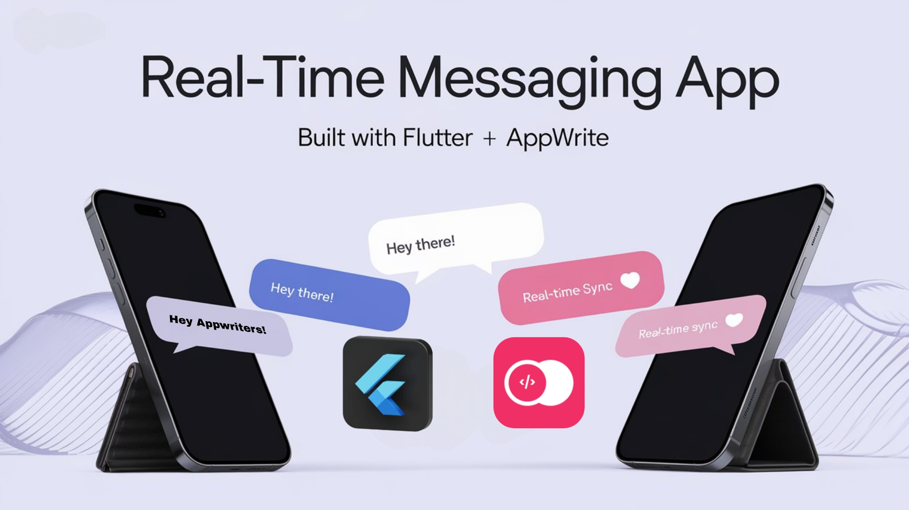

## Features

### Authentication
- **Phone Number Login** - Secure authentication using phone numbers with OTP verification
- **Email Login** - Traditional email and password authentication

### Contact Management
- **Contact Synchronization** - Automatically find friends who are using the app
- **Local Database Storage** - Efficiently stores contact information offline for quick access

### Messaging
- **One-to-One Chats** - Private conversations between two users
- **Group Conversations** - Create and manage group chats with multiple participants
- **Message Reactions** - React to messages with emojis
- **Reply to Messages** - Thread-style replies to keep conversations organized
- **Edit & Delete Messages** - Modify or remove sent messages
- **Rich Media Support** - Share images, videos, and files

### Stories
- **Story Sharing** - Share moments that disappear after 24 hours
- **View Control** - Choose which contacts can see your stories

### Group Management
- **Permission Controls** - Configure groups to allow everyone to send messages or restrict to admins and moderators only
- **Role Assignment** - Assign admin and moderator roles to members

## Screenshots

<div style="display: flex; flex-wrap: wrap; gap: 10px; justify-content: center;">
  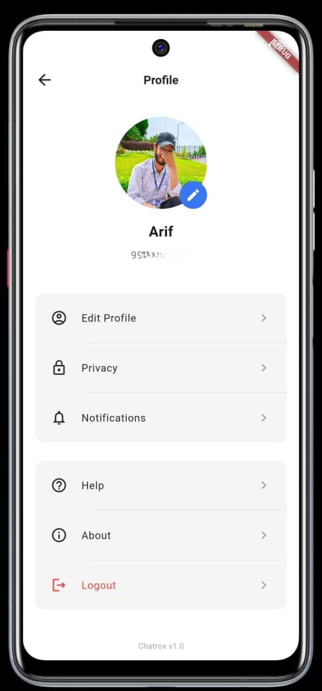
  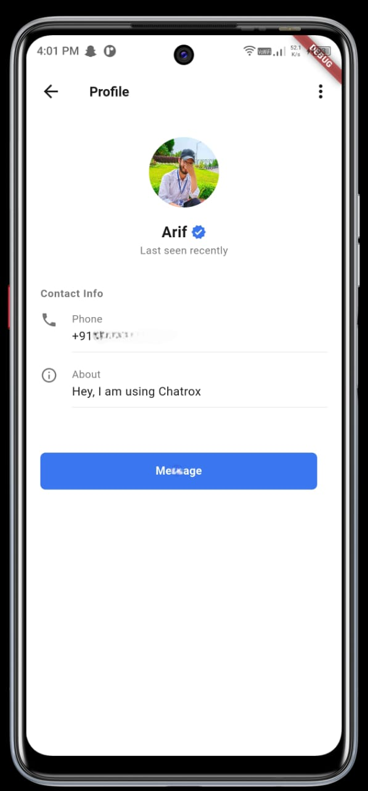
  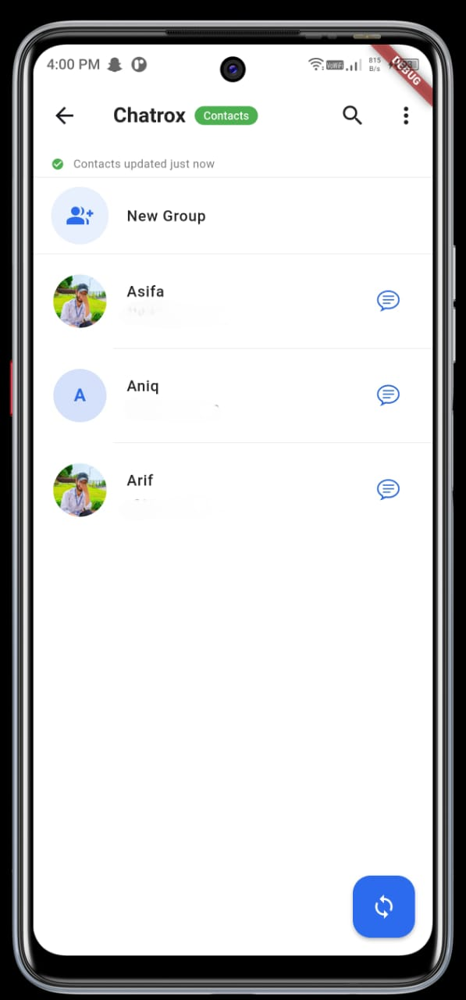
  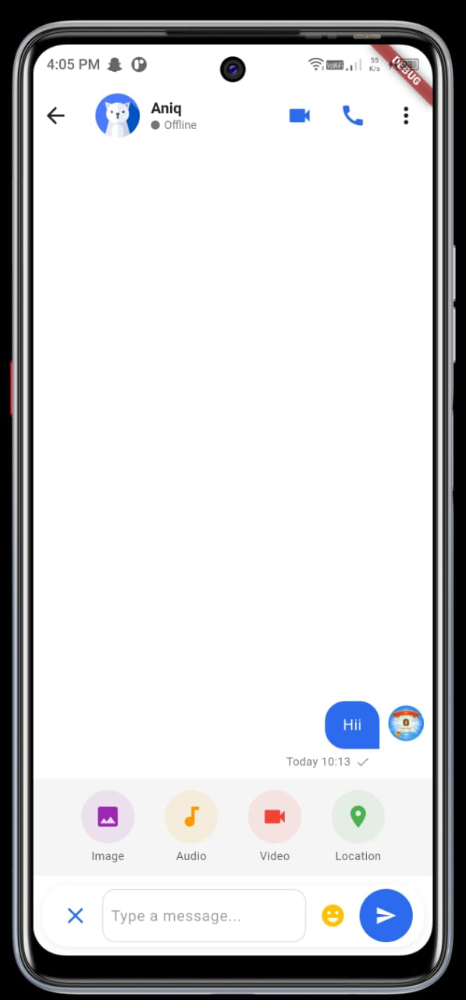
  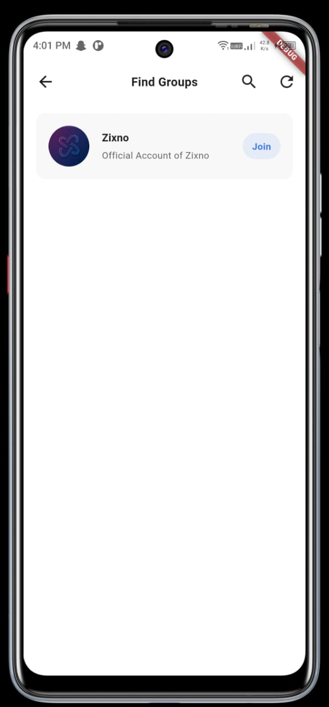
  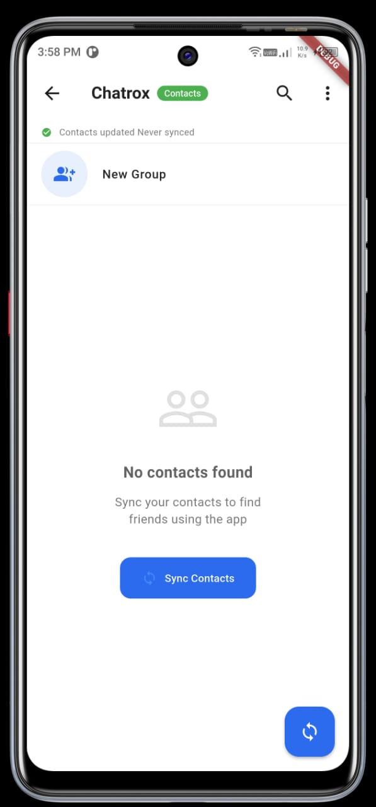
  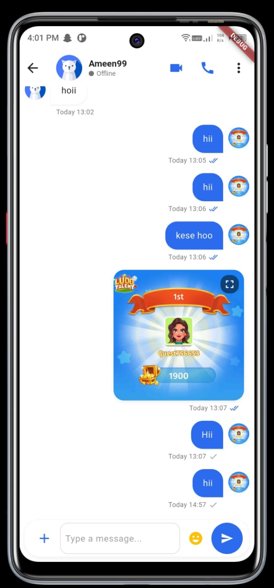
  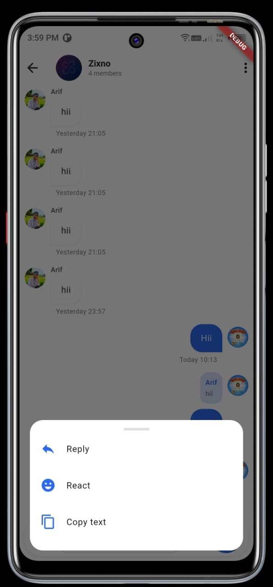
  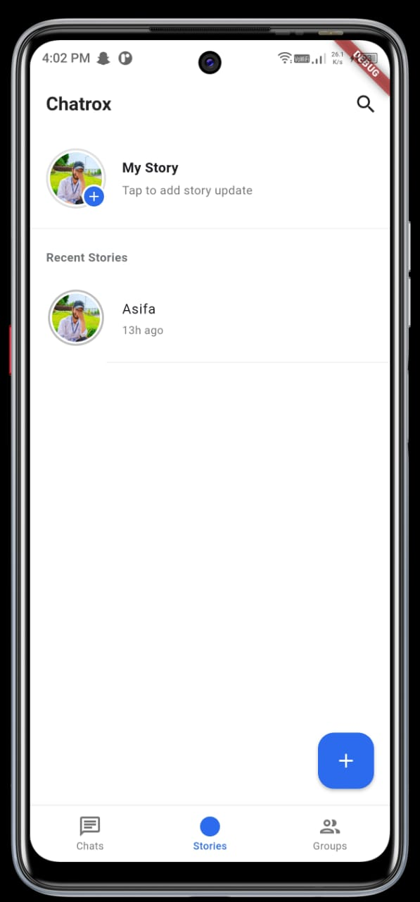
  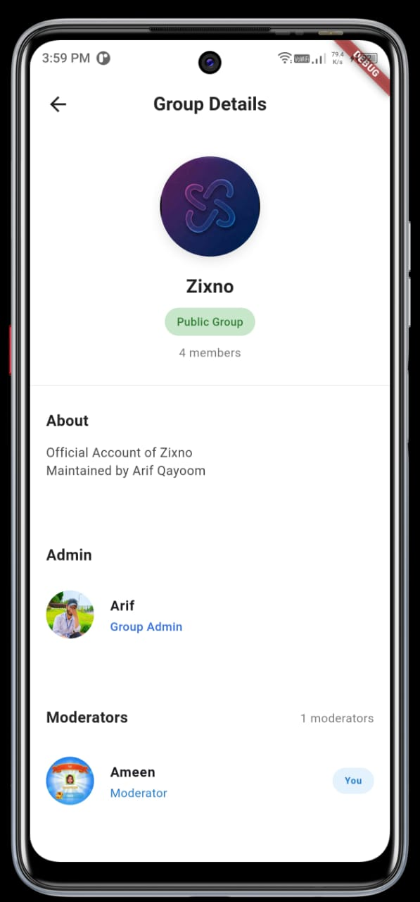
  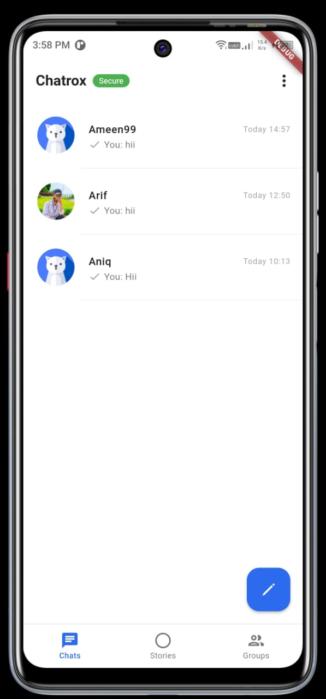
</div>

## Tech Stack

### Frontend
- **Flutter** - Cross-platform UI toolkit for building natively compiled applications
- **Provider** - State management solution
- **Shared** - storing contacts data

### Backend
- **Appwrite** - Open-source backend server providing:
  - Authentication
  - Database
  - Storage
  - Realtime updates
  - Cloud functions (For PushNotifications)

## Getting Started

### Prerequisites
- Flutter (2.5.0 or higher)
- Dart (2.14.0 or higher)
- Appwrite account

### Installation

1. Clone the repository
```bash
git https://github.com/arifqayoom39/chatrox.git
cd chat
```

2. Install dependencies
```bash
flutter pub get
```

3. Configure Appwrite
   - Create a project in Appwrite Console
   - Set up collections for users, messages, groups, and stories
   - All Appwrite configurations and collections are managed in `lib/controllers/appwrite_controller.dart`

4. Run the app
```bash
flutter run
```

## Contributing

Contributions are what make the open-source community an amazing place to learn, inspire, and create. Any contributions you make are **greatly appreciated**.

1. Fork the Project
2. Create your Feature Branch (`git checkout -b feature/AmazingFeature`)
3. Commit your Changes (`git commit -m 'Add some AmazingFeature'`)
4. Push to the Branch (`git push origin feature/AmazingFeature`)
5. Open a Pull Request

## Support

If you like this project, please give it a ⭐️ on GitHub to show your support!

## Try It Out

Want to test the app without setting up the development environment? Download our APK and give it a try!

[Download APK 'in Zip Folder'](https://uploadnow.io/s/ebf43208-3ab1-4771-8bf7-3642f6c5fe21)

**Note:** When testing the app, we recommend using only the email authentication option as the phone authentication requires additional server configuration.

## License

Distributed under the MIT License. See `LICENSE` for more information.

## Contact

For questions or feedback, please contact us via email: [arifqayoom39@gmail.com](mailto:arifqayoom39@gmail.com)
